# 📚 Flutter Book Management App

This is a book management system developed in Flutter. The application has two roles: **Administrator** and **User**, each with specific functionalities for book management and lending.

---

## 🚀 Features

### 🔐 Authentication Screens

- **Login Screen**: Allows users and administrators to log in to the app using their credentials.

  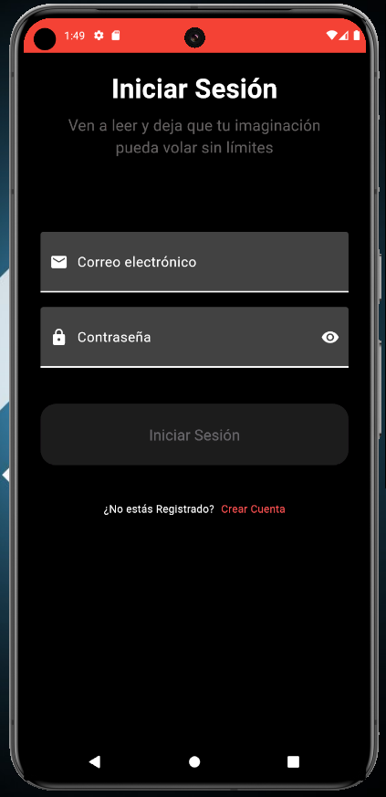

- **Registration Screen**: Allows new users to register in the app with their personal information.

  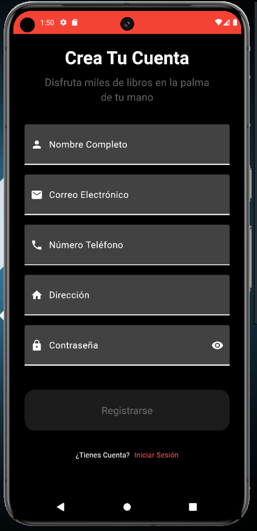

---

### 🛠 Administrator Features
- **View all available books**: The administrator can see the complete list of available books in the library.

  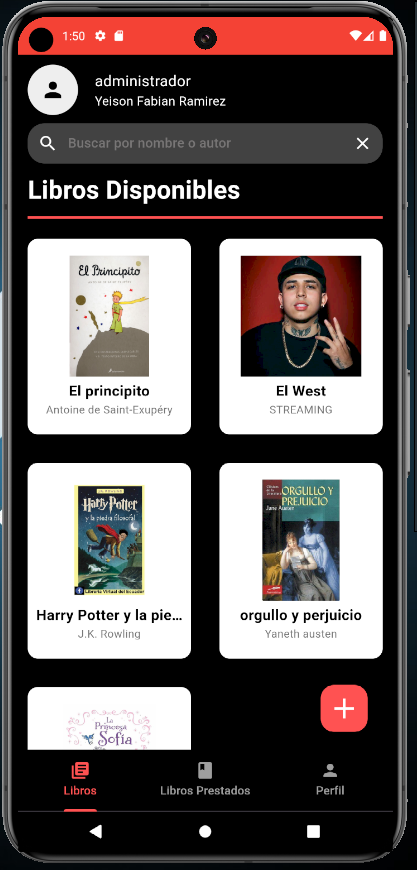

- **View borrowed books**: The administrator can check which books have been borrowed.

  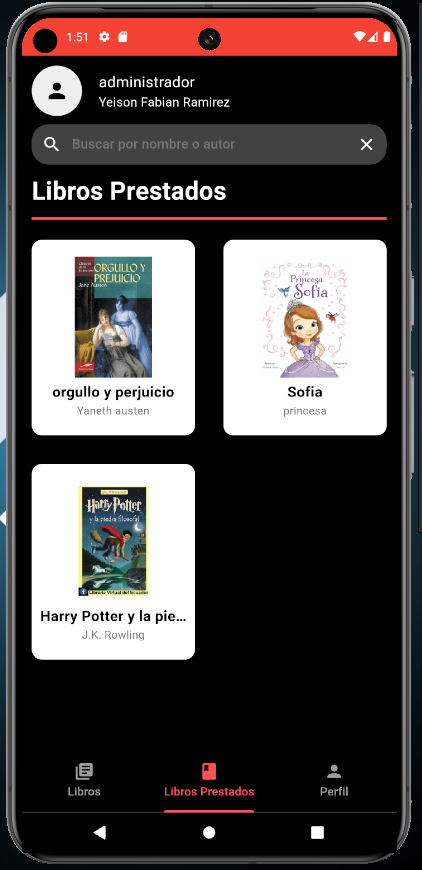

- **Loan history**: The administrator can view a history of people who have borrowed books.

  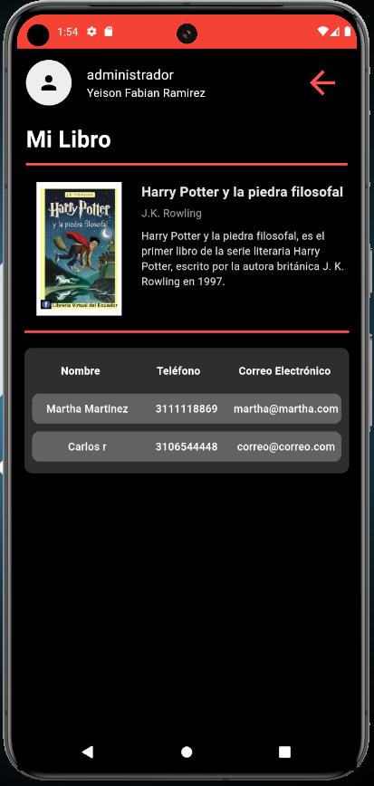

- **Update books**: Modify the information of an existing book.  
  **Delete books**: Remove a book from the library.

  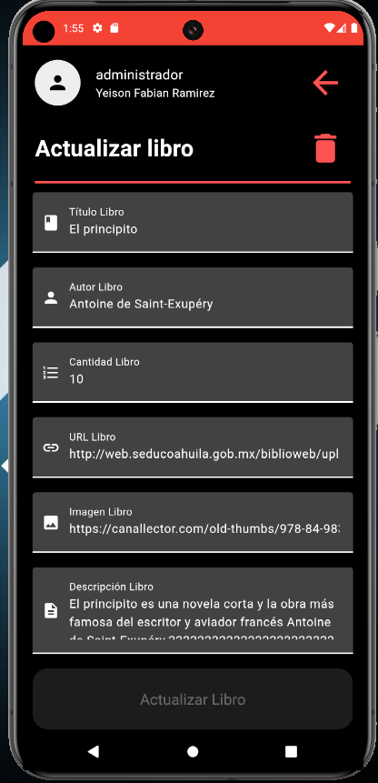

- **Create books**: Add new books to the available list.

  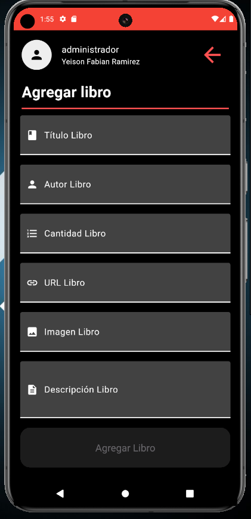

- **Profile settings**: Modify the banner logo on the main screen.

  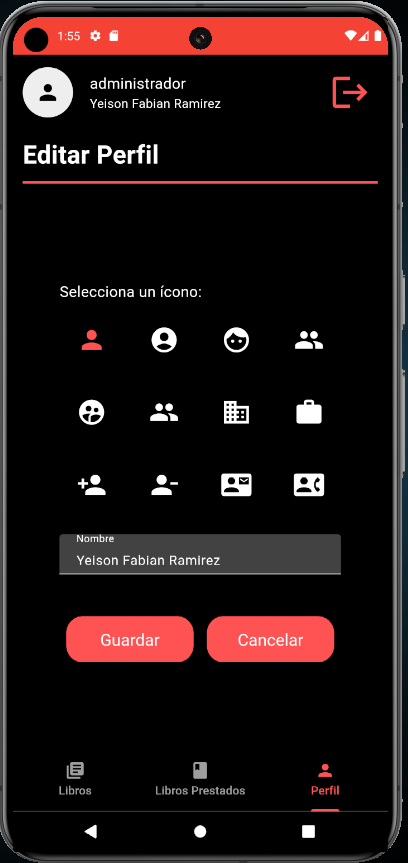

### 👤 User Features
- **View borrowed books**: Users can see the list of books they have borrowed.

  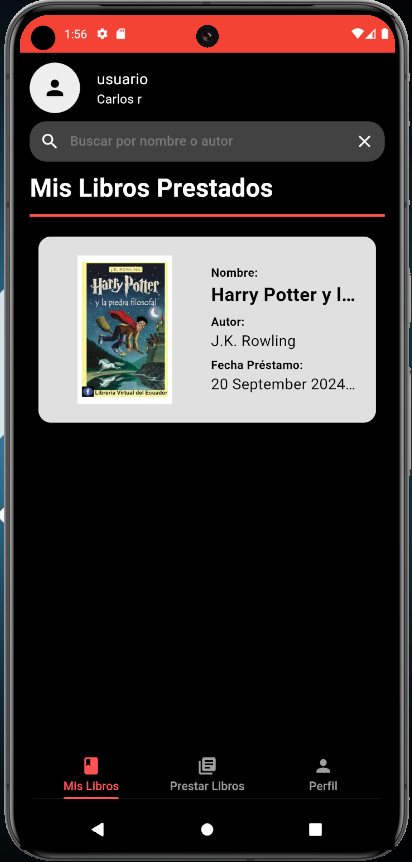

- **View all available books**: Access the complete list of books that can be borrowed.

  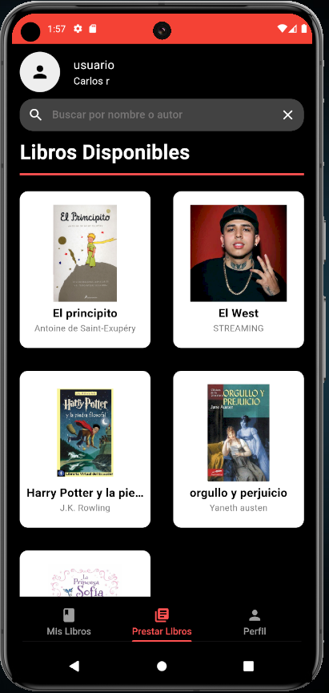

- **Borrow a book**: Users can select an available book to borrow.

  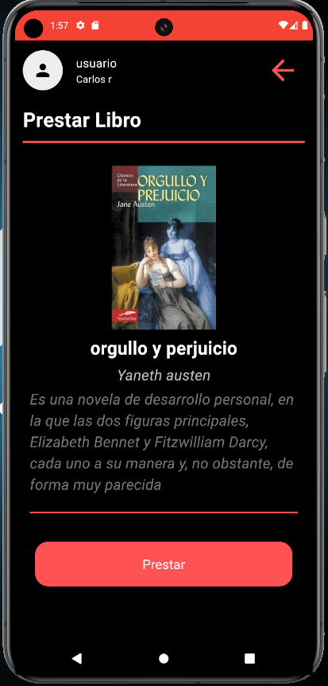

- **Return borrowed book**: Return a book that has previously been borrowed.

  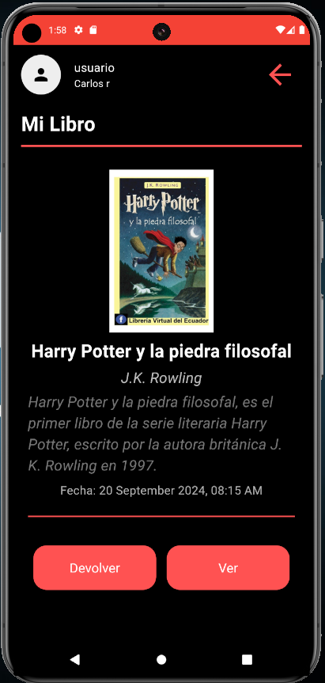

- **Read borrowed book**: Access borrowed books for reading within the app.

  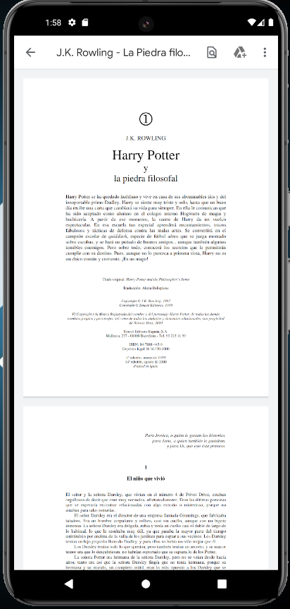

- **Profile settings**: Modify the banner logo on the main screen, similar to the administrator.

  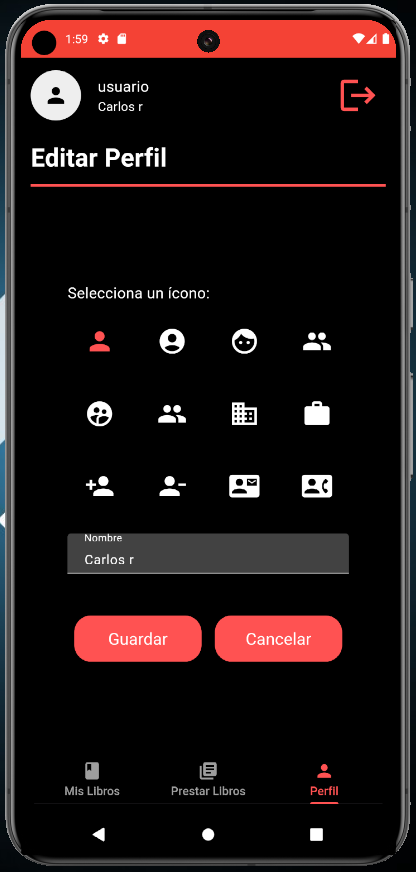

---

## ⚙️ Installation

To run this application on your local machine, follow these steps:

1. Clone the repository:
   ```bash
   git clone https://github.com/YeisonRamirezSuarez/Libreria2.0.git

2. Navigate to the project directory:
   ```bash
   cd Libreria2.0

3. Perform a flutter clean and update the repository packages:
   ```bash
   flutter clean
   flutter pub get

Ensure you have Flutter SDK and Java installed.

🛠 System Requirements
Flutter SDK
Java SDK
Android Studio or Visual Studio Code any IDE compatible with Flutter

📄 License
If you decide to use this code or part of it, don't forget to give me credit.

💡 Motivation Quote
"Code is poetry, and you are the poet."
